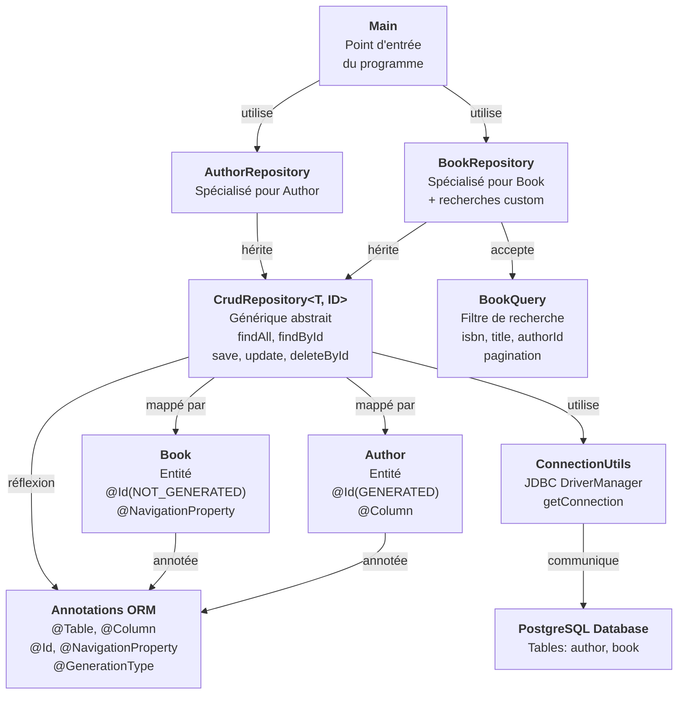
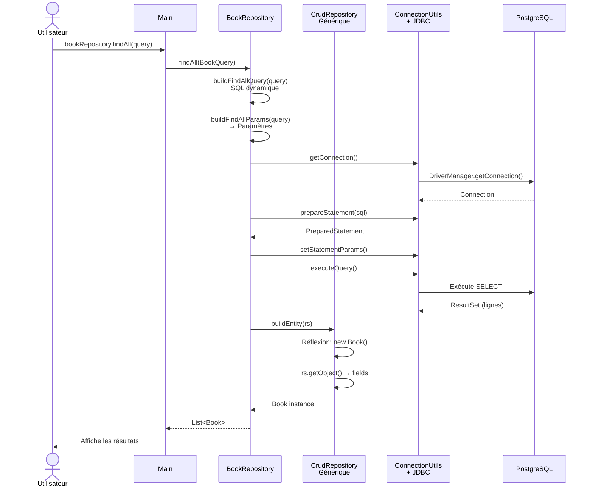

# TI Java 2026 - Démonstration JDBC avec CrudRepository Générique

Un projet éducatif montrant comment implémenter un **framework ORM minimaliste** en Java pur, sans dépendre de bibliothèques comme Hibernate ou JPA.

## 📚 Table des Matières

1. [Qu'est-ce que JDBC ?](#quest-ce-que-jdbc)
2. [Architecture du Projet](#architecture-du-projet)
3. [Diagramme de Classe Mermaid](#diagramme-de-classe-mermaid)
4. [Pourquoi un CrudRepository ?](#pourquoi-un-crudrepository)
5. [Installation & Configuration](#installation--configuration)
6. [Exemples d'Utilisation](#exemples-dutilisation)

---

## Qu'est-ce que JDBC ?

### 🎯 Définition

**JDBC** (Java Database Connectivity) est une **API standard Java** qui permet à votre application de communiquer avec une **base de données relationnelle** (PostgreSQL, MySQL, Oracle, etc.).

C'est le **couche la plus basse** : elle traduit vos opérations Java en requêtes SQL pour la base de données.

### 🔄 Le flux JDBC en 4 étapes

```
┌─────────────────────────────────────────────────────────────┐
│  1. OBTENIR UNE CONNEXION                                   │
│     DriverManager.getConnection(url, user, password)        │
│     ↓ Ouvre un tunnel avec la base de données               │
├─────────────────────────────────────────────────────────────┤
│  2. CRÉER UN PREPARED STATEMENT                             │
│     conn.prepareStatement("SELECT * FROM book WHERE id = ?")│
│     ↓ Prépare la requête SQL avec des paramètres sûrs       │
├─────────────────────────────────────────────────────────────┤
│  3. EXÉCUTER LA REQUÊTE                                     │
│     stmt.executeQuery()  → SELECT / Récupère des données    │
│     stmt.executeUpdate() → INSERT/UPDATE/DELETE / Modifie   │
│     ↓ La base de données traite votre demande               │
├─────────────────────────────────────────────────────────────┤
│  4. TRAITER LES RÉSULTATS                                   │
│     ResultSet rs = stmt.executeQuery()                      │
│     while (rs.next()) { ... }                               │
│     ↓ Récupère les données ligne par ligne                  │
└─────────────────────────────────────────────────────────────┘
```

### 💡 Analogie

Pense à JDBC comme à **une conversation téléphonique avec une base de données** :

1. **Tu appelles** → `getConnection()` (tu composes le numéro)
2. **Tu formules ta question** → `prepareStatement()` (tu dis ce que tu veux)
3. **La base te répond** → `executeQuery()` (elle traite)
4. **Tu lis la réponse** → `ResultSet` (elle te dit les résultats)

### ⚠️ Les Problèmes de JDBC Brut

Sans framework, voici ce que tu dois faire **POUR CHAQUE** opération DB :

```java
// ❌ Du code répétitif, lourd et sujet aux erreurs
public void saveBook(Book book) throws SQLException {
    Connection conn = DriverManager.getConnection(url, user, pwd);
    try {
        String sql = "INSERT INTO book (isbn, title, author_id) VALUES (?, ?, ?)";
        PreparedStatement stmt = conn.prepareStatement(sql);
        stmt.setString(1, book.getIsbn());
        stmt.setString(2, book.getTitle());
        stmt.setInt(3, book.getAuthorId());
        stmt.executeUpdate();
        stmt.close();
    } finally {
        conn.close();  // Attention à fermer les ressources !
    }
}

public List<Book> getAllBooks() throws SQLException {
    Connection conn = DriverManager.getConnection(url, user, pwd);
    try {
        List<Book> books = new ArrayList<>();
        String sql = "SELECT isbn, title, author_id FROM book";
        PreparedStatement stmt = conn.prepareStatement(sql);
        ResultSet rs = stmt.executeQuery();
        while (rs.next()) {
            Book b = new Book(
                rs.getString("isbn"),
                rs.getString("title"),
                rs.getInt("author_id")
            );
            books.add(b);
        }
        rs.close();
        stmt.close();
        return books;
    } finally {
        conn.close();
    }
}

// Et c'est pareil pour update(), delete(), findById()...
// 😫 Imagine avec 20 entités différentes !
```

**C'est là qu'intervient notre CrudRepository générique.**

---

## Architecture du Projet

```
be.bstorm/
│
├── annotations/              ← Métadonnées pour mapper Java ↔ Base de données
│   ├── @Table              → "Cette classe = cette table en DB"
│   ├── @Column             → "Ce champ = cette colonne en DB"
│   ├── @Id                 → "Ceci est la clé primaire"
│   ├── @GenerationType     → "Auto-générée ou fournie par l'utilisateur"
│   └── @NavigationProperty → "Ceci est une relation, pas une colonne"
│
├── entities/                ← Les classes Java qui représentent tes données
│   ├── Author              → Auteur (ID auto-généré)
│   └── Book                → Livre (ISBN fourni)
│
├── repositories/            ← Couche d'accès aux données (CRUD)
│   ├── CrudRepository       → Générique : fait le travail POUR TOUS les types
│   ├── AuthorRepository    → Spécialisé : hérite, ajoute des recherches custom
│   └── BookRepository      → Spécialisé : hérite, ajoute des recherches custom
│
├── models/                  ← Modèles de requête (filtrage, pagination)
│   └── BookQuery           → Classe pour coder les critères de recherche
│
├── utils/                   ← Utilitaires
│   └── ConnectionUtils     → Gère les connexions à PostgreSQL
│
└── Main.java               ← Point d'entrée : teste les repositories
```

---

## Diagramme de Classe Mermaid

### Structure générale du projet



### Flux de données lors d'une recherche `findAll(BookQuery)`



---

## Pourquoi un CrudRepository ?

### Le Problème : Code Répétitif

Chaque entité (Author, Book, etc.) a besoin des mêmes 5 opérations :
- **C**reate (INSERT)
- **R**ead (SELECT)
- **U**pdate (UPDATE)
- **D**elete (DELETE)

Sans framework, tu écris le même code **20 fois pour 20 entités**. 😫

### La Solution : Généricité + Réflexion

```
CrudRepository<TEntity, TId>
    ↓
Classe générique qui :
1. Accepte N'IMPORTE QUEL type T (Author, Book, User, etc.)
2. Accepte N'IMPORTE QUEL type de clé (Integer, String, Long, etc.)
3. Lit les ANNOTATIONS de T à la construction
4. Génère le SQL AUTOMATIQUEMENT
5. Utilise la RÉFLEXION pour lire/écrire les champs
```

### 🎯 Les 3 Pilliers de cette Magie

#### 1️⃣ **Les Annotations** = La Carte du Trésor

```java
@Table(name = "author")
public class Author {
    @Id(generation = GenerationType.GENERATED)
    @Column(name = "id")
    private Integer id;
    
    @Column(name = "firstname")
    private String firstName;
}
```

**Qu'elles disent :** *"Author est la table 'author', id est PK auto-générée, firstname → colonne 'firstname'"*

Le CrudRepository **lit ces annotations** et sait exactement quelle table/colonnes utiliser.

#### 2️⃣ **La Réflexion** = Lire et Écrire les Champs

```java
Field idField = entityClass.getDeclaredField("id");
idField.setAccessible(true);
idField.set(author, 42);  // ← Écrit 42 dans author.id, même si c'est private !
```

**Qu'elle permet :** Accéder aux champs **dynamiquement**, sans avoir besoin de code spécifique pour chaque classe.

#### 3️⃣ **La Généricité Java** = Un Code pour Tous

```java
public class CrudRepository<TEntity, TId> {
    // Les paramètres de type T et ID sont résolus
    // Une fois à la construction via ParameterizedType
    
    public List<TEntity> findAll() { ... }
    public TEntity save(TEntity entity) { ... }
}

// Utilisation pour Author :
public class AuthorRepository extends CrudRepository<Author, Integer> {
    // Hérité : findAll() retourne List<Author>
    // Hérité : save(Author entity) fonctionne
}

// Utilisation pour Book :
public class BookRepository extends CrudRepository<Book, String> {
    // Hérité : findAll() retourne List<Book>
    // Hérité : save(Book entity) fonctionne
}
```

### 🚀 Résultat

**AVANT** (sans CrudRepository) :
```
Author.java          Author.java          Author.java
  ↓ (100 lignes)         ↓ (100 lignes)         ↓ (100 lignes)
findAll()            save()               update()
deleteById()         existsById()         count()
... Répété 20 fois pour 20 entités
```

**APRÈS** (avec CrudRepository) :
```
CrudRepository<T, ID>
    ↓ (600 lignes, écrit UNE seule fois)
    ├─ AuthorRepository (3 lignes) ✨
    ├─ BookRepository (3 lignes) ✨
    ├─ UserRepository (3 lignes) ✨
    ├─ PostRepository (3 lignes) ✨
    └─ ... 20 repositories différents, TOUS générés automatiquement
```

**Économie de 2000 lignes de code !** 🎉

### 📝 Exemple : Comment CrudRepository Génère le SQL

```java
// Code utilisateur :
AuthorRepository repo = new AuthorRepository();
List<Author> all = repo.findAll();

// Sous le capot, CrudRepository<Author, Integer> :
// 1. Lit @Table(name = "author") → tableName = "author"
// 2. Lit tous les @Column → selectColumns = "id, firstname, lastname, birthdate"
// 3. Construit le SQL :
//    SELECT id, firstname, lastname, birthdate FROM author
// 4. Exécute via JDBC
// 5. Transforme chaque ResultSet en Author via réflexion
// 6. Retourne List<Author>
```

---

## Installation & Configuration

### 📋 Prérequis

- **Java 25+**
- **Maven 3.9+**
- **PostgreSQL 14+**

### 🗄️ Configuration Base de Données

1. Crée une base PostgreSQL :
```sql
CREATE DATABASE demo_jdbc;
```

2. Crée les tables :
```sql
-- Table des auteurs
CREATE TABLE author (
    id SERIAL PRIMARY KEY,
    firstname VARCHAR(100) NOT NULL,
    lastname VARCHAR(100) NOT NULL,
    birthdate DATE
);

-- Table des livres
CREATE TABLE book (
    isbn VARCHAR(20) PRIMARY KEY,
    title VARCHAR(255) NOT NULL,
    description TEXT,
    author_id INTEGER REFERENCES author(id)
);

-- Données de test
INSERT INTO author (firstname, lastname, birthdate) 
VALUES ('George', 'Orwell', '1903-06-25');

INSERT INTO book (isbn, title, description, author_id)
VALUES ('978-0451524935', '1984', 'Dystopian novel', 1);
```

3. Configure dans `ConnectionUtils.java` :
```java
private static final String URL = "jdbc:postgresql://localhost:5432/demo_jdbc";
private static final String USER = "postgres";
private static final String PASSWORD = "postgres";
```

### 🚀 Compiler et Exécuter

```bash
mvn clean package
java -cp target/classes be.bstorm.Main
```

---

## Exemples d'Utilisation

### ✅ Créer un Auteur (INSERT)

```java
AuthorRepository authorRepo = new AuthorRepository();

Author author = new Author(
    null,                           // ID null → sera auto-généré
    "Stephen",
    "King",
    LocalDate.of(1947, 9, 21)
);

Author saved = authorRepo.save(author);
System.out.println(saved.getId());  // 1, 2, 3, ... (auto-généré !)
```

**Qu'il se passe :**
1. Le repo détecte que `id` est `@Id(generation = GENERATED)`
2. Exclut `id` de l'INSERT
3. Exécute : `INSERT INTO author (firstname, lastname, birthdate) VALUES (?, ?, ?)`
4. Récupère l'ID auto-généré
5. L'assigne à `author.id`

### ✅ Lire tous les Auteurs (SELECT)

```java
List<Author> authors = authorRepo.findAll();
authors.forEach(a -> System.out.println(a.getFirstName() + " " + a.getLastName()));
```

**SQL généré :**
```sql
SELECT id, firstname, lastname, birthdate FROM author
```

### ✅ Chercher par ID (SELECT WHERE)

```java
Optional<Author> author = authorRepo.findById(1);
author.ifPresent(a -> System.out.println(a));
```

**SQL généré :**
```sql
SELECT id, firstname, lastname, birthdate FROM author WHERE id = ?
```

### ✅ Mettre à Jour (UPDATE)

```java
Author author = new Author(null, "Jane", "Doe", LocalDate.now());
Author updated = authorRepo.update(1, author);
```

**SQL généré :**
```sql
UPDATE author SET firstname = ?, lastname = ?, birthdate = ? WHERE id = ?
```

### ✅ Supprimer (DELETE)

```java
Author deleted = authorRepo.deleteById(1);
```

**SQL généré :**
```sql
DELETE FROM author WHERE id = ?
```

### ✅ Recherche Filtrée avec Pagination (Custom)

```java
BookRepository bookRepo = new BookRepository();

List<Book> results = bookRepo.findAll(new BookQuery(
    "978",      // Filtrer ISBN contenant "978"
    "1984",     // Filtrer titre contenant "1984"
    1,          // Auteur ID = 1
    0,          // Page 0 (première page)
    10          // 10 résultats par page
));

results.forEach(System.out::println);
```

**SQL généré (dynamiquement) :**
```sql
SELECT isbn, title, description, author_id FROM book
WHERE isbn LIKE ? 
  AND title LIKE ?
  AND author_id = ?
ORDER BY isbn
LIMIT 10 OFFSET 0
```

### ✅ JOIN Personnalisé (Navigation Property)

```java
Optional<Book> book = bookRepo.findByIsbn("978-0451524935");

if (book.isPresent()) {
    System.out.println("Livre: " + book.get().getTitle());
    System.out.println("Auteur: " + book.get().getAuthor().getFirstName());
}
```

**SQL généré (spécifiquement pour Book) :**
```sql
SELECT b.isbn, b.title, b.description, b.author_id,
       a.id, a.firstname, a.lastname, a.birthdate
FROM book b
LEFT JOIN author a ON b.author_id = a.id
WHERE b.isbn = ?
```

---

## 🎓 Concepts Clés pour les Apprenants

### Annotation vs Exécution

Les annotations **ne font rien seules**. Elles sont juste des **métadonnées**.

```java
@Table(name = "author")     // ← C'est quoi ?
public class Author { }      //   Juste du texte !
```

C'est le **CrudRepository** qui **LIT** ces annotations et les **UTILISE** :

```java
@Override
protected CrudRepository() {
    // CrudRepository lit les annotations à la construction
    this.tableName = resolveTableName(entityClass);  // Lit @Table
    this.mappedFields = resolveMappedFields(entityClass);  // Lit @Column
    this.idField = resolveIdField(mappedFields);  // Lit @Id
}
```

### Réflexion = Introspection du Code

La réflexion te permet d'inspecter et manipuler le code **à l'exécution**.

```java
// Accès normal (compile-time) :
Author author = new Author();
author.setFirstName("John");  // Connu à la compilation

// Réflexion (runtime) :
Class<?> clazz = Author.class;
Field field = clazz.getDeclaredField("firstName");  // On cherche le champ dynamiquement
field.setAccessible(true);  // Accès aux private
field.set(author, "John");  // Écrit dans le champ sans appeler setFirstName()
```

**Pourquoi c'est puissant :**
- Code générique : marche pour **n'importe quel** classe
- Dynamique : découvre les champs **à l'exécution**, pas en compilant

### Try-with-Resources = Gestion Automatique

```java
try (Connection conn = getConnection();
     PreparedStatement stmt = conn.prepareStatement(sql);
     ResultSet rs = stmt.executeQuery()) {
    
    // Utiliser les ressources
    while (rs.next()) { ... }
    
} // ← Les ressources sont FERMÉES AUTOMATIQUEMENT, même en cas d'exception !
```

**Sans try-with-resources :**
```java
Connection conn = null;
try {
    conn = getConnection();
    // ...
} finally {
    if (conn != null) {
        conn.close();  // ← À faire manuellement, risque d'oublier !
    }
}
```

---

## 📚 Ressources Supplémentaires

- [Oracle JDBC Tutorial](https://docs.oracle.com/javase/tutorial/jdbc/)
- [PostgreSQL JDBC Driver](https://jdbc.postgresql.org/)
- [Java Reflection API](https://docs.oracle.com/en/java/javase/21/docs/api/java.base/java/lang/reflect/package-summary.html)
- [Project Lombok](https://projectlombok.org/)

---

**Créé pour les apprenants en Java - TI 2026**

